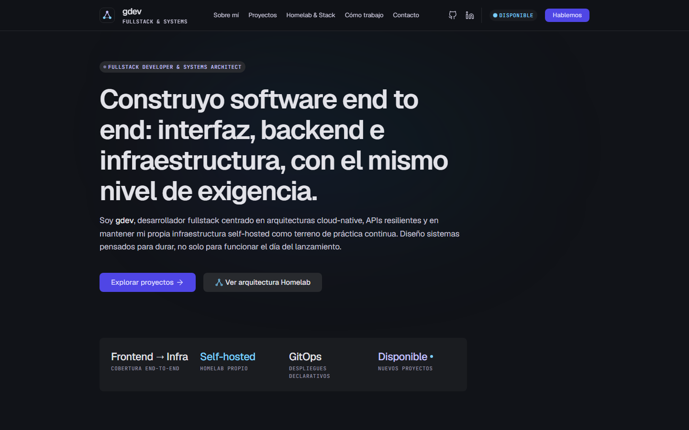
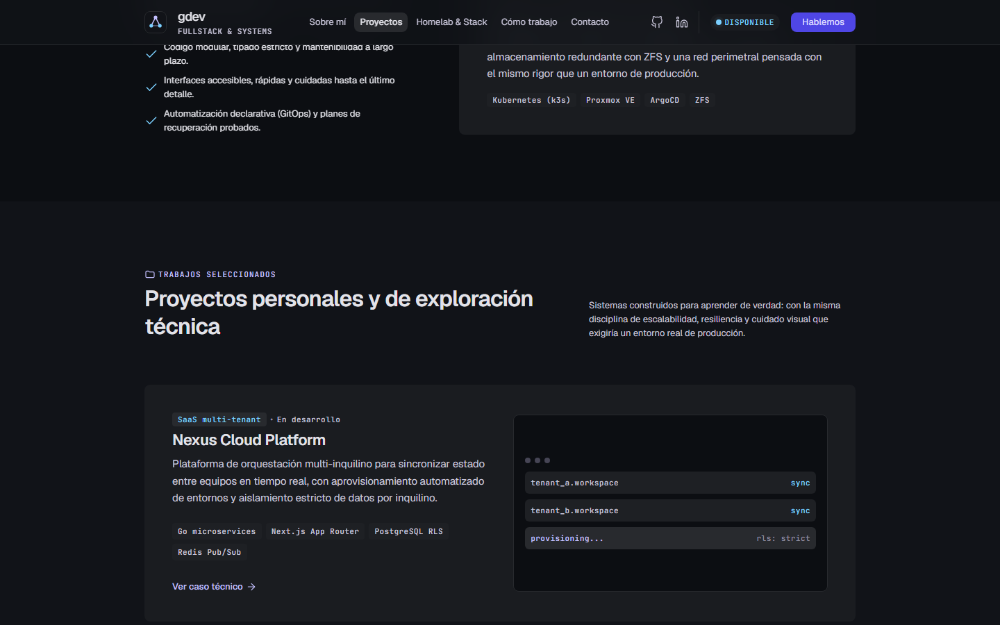
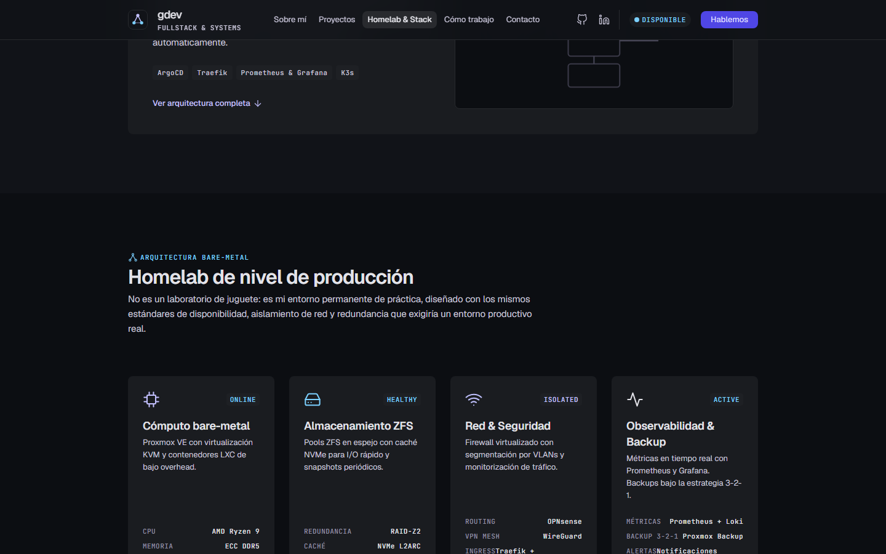

# gdev — Portfolio Web

Portfolio personal de **gdev** — Fullstack Developer & Systems Architect. Sitio estático de una sola página construido con HTML + Tailwind CSS, sin build de JS ni frameworks, pensado para desplegarse como contenedor Nginx.

🔗 Producción esperada: `http://localhost:2323` vía Docker (ver [Despliegue](#despliegue)).

## Capturas

**Hero**


**Proyectos personales**


**Homelab de nivel de producción**


## Contenido del sitio

La landing (`index.html`) es una sola página con las siguientes secciones:

- **Hero** — presentación y propuesta de valor.
- **Sobre mí** — trayectoria y enfoque de trabajo.
- **Proyectos** — trabajos personales y de exploración técnica (casos técnicos con stack detallado).
- **Homelab & Stack** — arquitectura bare-metal (Proxmox VE, k3s, ArgoCD, ZFS) y stack tecnológico general.
- **Cómo trabajo** — metodología de principio a fin.
- **Contacto** — formulario que arma un `mailto:` (no hay backend; es 100% estático).

## Estructura del proyecto

```
meetgdev-web/
├── index.html            # Landing page (contenido y markup)
├── template.html          # Plantilla/base usada para maquetar el sitio
├── desing.md              # Design system: colores, tipografía, spacing, componentes
├── assets/
│   ├── app.js              # JS vanilla: menú móvil, scrollspy, año del footer, form → mailto
│   └── favicon.svg
├── src/
│   └── input.css           # Entrada de Tailwind CSS
├── dist/
│   └── styles.css          # CSS compilado/minificado (salida de Tailwind)
├── tailwind.config.js      # Configuración de Tailwind (tokens del design system)
├── robots.txt
├── Dockerfile              # Imagen Nginx sirviendo el sitio estático
├── docker-compose.yml      # Servicio para levantar el contenedor
├── nginx.conf              # Config de Nginx (gzip, cache-control, SPA fallback)
└── package.json
```

## Stack técnico

| Área              | Tecnología                                    |
| ----------------- | ---------------------------------------------- |
| Markup            | HTML5 semántico                                |
| Estilos           | Tailwind CSS 3 (compilado a `dist/styles.css`) |
| Interactividad    | JavaScript vanilla (sin frameworks)            |
| Servidor          | Nginx (imagen `nginx:1.27-alpine`)             |
| Contenerización   | Docker / Docker Compose                        |

## Desarrollo local

Requiere Node.js (solo para compilar Tailwind).

```bash
npm install

# Compilar CSS una vez
npm run build

# Recompilar en watch mode mientras editas src/input.css
npm run watch

# Servir el sitio en http://localhost:4173
npm run serve
```

## Despliegue

El sitio se sirve como estático puro detrás de Nginx.

```bash
docker compose up -d --build
```

Esto expone el sitio en **http://localhost:2323**. `nginx.conf` habilita gzip, cache agresiva para `assets/` y `dist/`, y healthcheck en `Dockerfile`.

## Licencia

ISC
